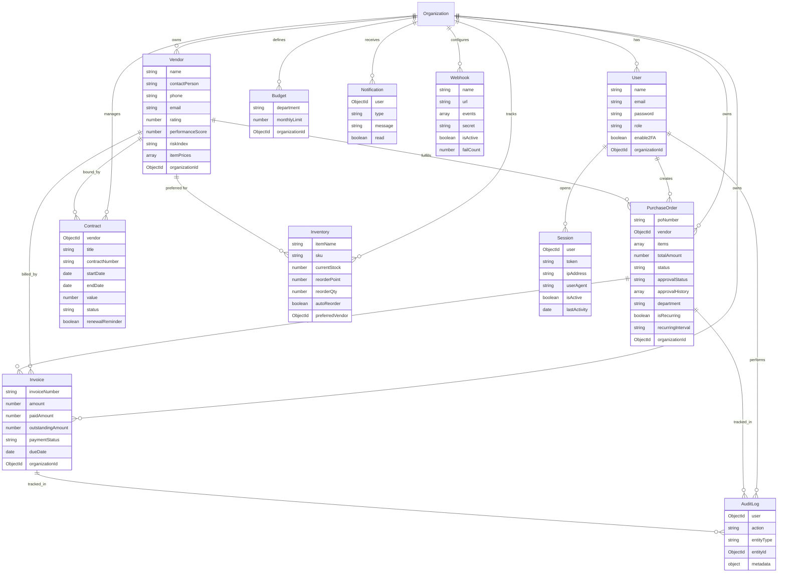
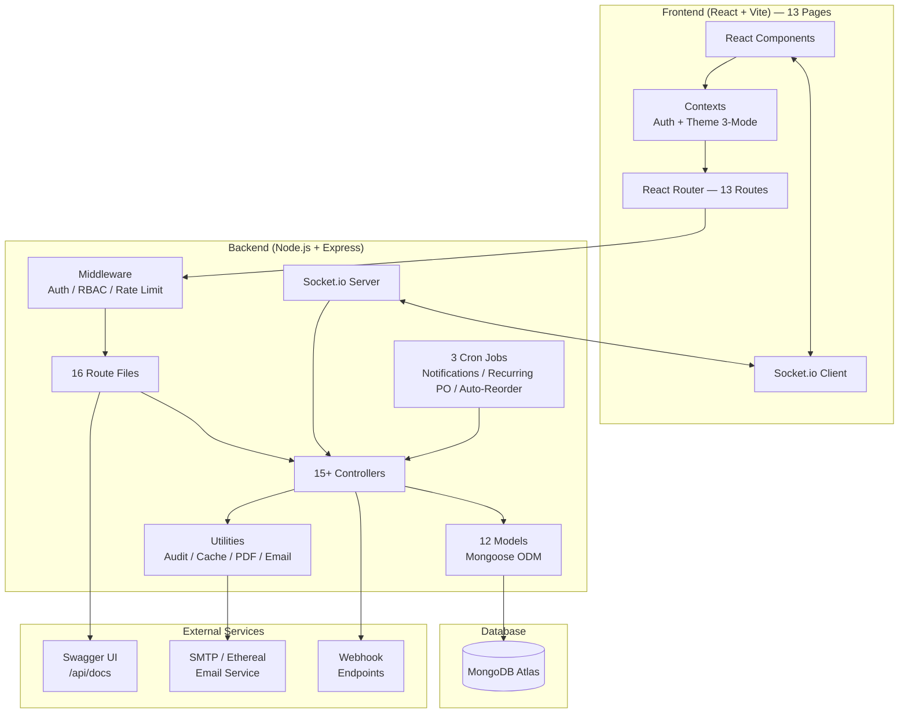
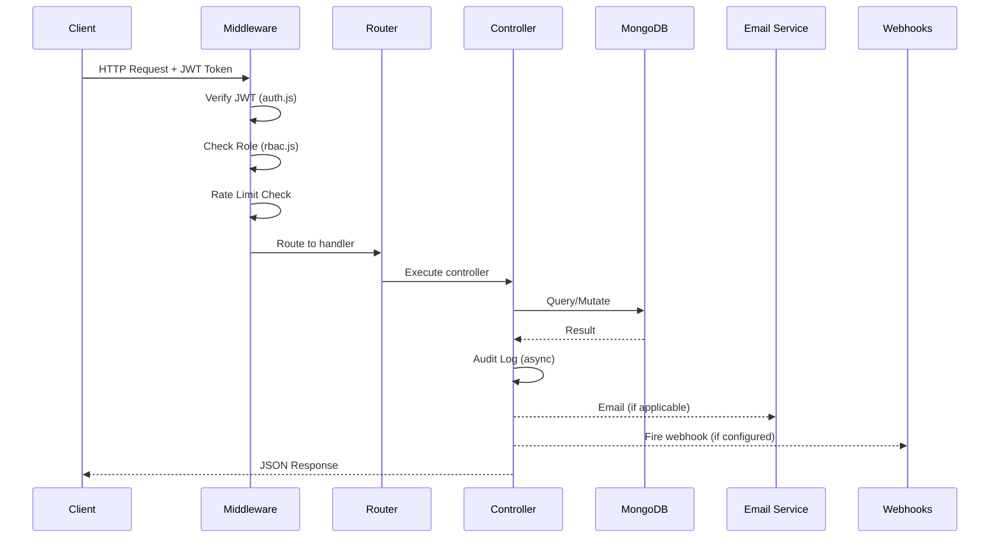
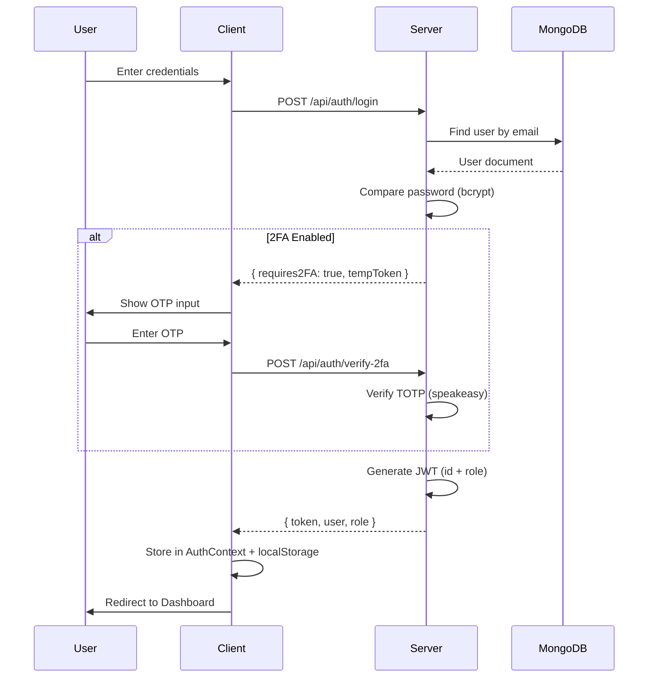
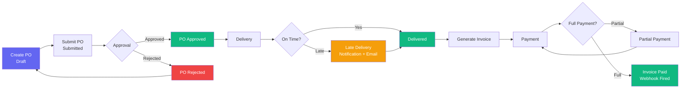
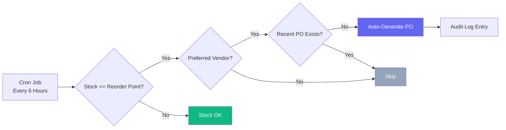

# System Design — Vendor & PO Manager (Enterprise SaaS v3.0)

## ER Diagram

## Architecture Diagram

## API Routes (16 Files)

| Route File | Prefix | Endpoints | RBAC |
|------------|--------|-----------|------|
| `authRoutes.js` | `/api/auth` | login, register, me, 2FA | Public/Protected |
| `userRoutes.js` | `/api/users` | CRUD, reset-password | Admin only |
| `vendorRoutes.js` | `/api/vendors` | CRUD, performance, compare, suggest | Admin, Manager |
| `poRoutes.js` | `/api/purchase-orders` | CRUD, approve/reject | Admin, Manager |
| `invoiceRoutes.js` | `/api/invoices` | CRUD, record-payment | Admin, Accountant |
| `dashboardRoutes.js` | `/api/dashboard` | stats | All authenticated |
| `analyticsRoutes.js` | `/api/analytics` | aging, spend, growth, reliability, forecast, anomalies, compliance | Admin, Manager |
| `budgetRoutes.js` | `/api/budgets` | CRUD, utilization | Admin, Manager |
| `auditRoutes.js` | `/api/audit-logs` | list | Admin only |
| `notificationRoutes.js` | `/api/notifications` | list, mark-read | All authenticated |
| `importRoutes.js` | `/api/import` | CSV import | Admin, Manager |
| `exportRoutes.js` | `/api/export` | Excel export (vendors/POs/invoices/audit) | Role-based |
| `contractRoutes.js` | `/api/contracts` | CRUD with expiry tracking | Admin, Manager |
| `inventoryRoutes.js` | `/api/inventory` | CRUD with stock status | Admin, Manager |
| `webhookRoutes.js` | `/api/webhooks` | CRUD, event config | Admin only |

## Frontend Pages (13 Routes)

| Page | Route | Section |
|------|-------|---------|
| Dashboard | `/` | Main Menu |
| Vendors | `/vendors` | Main Menu |
| Purchase Orders | `/purchase-orders` | Main Menu |
| Invoices | `/invoices` | Main Menu |
| Kanban Board | `/kanban` | Main Menu |
| Contracts | `/contracts` | Management |
| Inventory | `/inventory` | Management |
| Budgets | `/budgets` | Management |
| Analytics | `/analytics` | Intelligence |
| Forecasting | `/forecast` | Intelligence |
| Vendor Compare | `/vendor-compare` | Intelligence |
| User Management | `/users` | Administration |
| Audit Logs | `/audit-logs` | Administration |

## API Flow

## Authentication Flow

## Data Lifecycle

## Inventory Auto-Reorder Flow

## RBAC Permissions Matrix

| Permission | Admin | Manager | Accountant | Viewer |
|------------|:-----:|:-------:|:----------:|:------:|
| Dashboard | ✅ | ✅ | ✅ | ✅ |
| Vendors (Read/Write) | ✅/✅ | ✅/✅ | ❌/❌ | ✅/❌ |
| Purchase Orders (Read/Write) | ✅/✅ | ✅/✅ | ❌/❌ | ✅/❌ |
| Invoices (Read/Write) | ✅/✅ | ❌/❌ | ✅/✅ | ✅/❌ |
| Analytics | ✅ | ✅ | ✅ | ❌ |
| Budgets | ✅ | ✅ | ✅ | ❌ |
| Audit Logs | ✅ | ❌ | ❌ | ❌ |
| User Management | ✅ | ❌ | ❌ | ❌ |
| Contracts | ✅ | ✅ | ❌ | ✅ |
| Inventory | ✅ | ✅ | ❌ | ✅ |
| Kanban Board | ✅ | ✅ | ❌ | ✅ |
| Forecasting | ✅ | ✅ | ❌ | ❌ |
| Vendor Compare | ✅ | ✅ | ❌ | ❌ |

## Cron Jobs

| Job | Schedule | Action |
|-----|----------|--------|
| Notification Generation | Every hour | Check overdue invoices, late deliveries, budget alerts |
| Recurring PO Generation | Daily midnight | Clone delivered recurring POs based on interval |
| Inventory Auto-Reorder | Every 6 hours | Generate POs for items below reorder point |

## Scaling Strategy

| Layer | Strategy |
|-------|----------|
| **Database** | MongoDB Atlas with replica sets, sharding by organizationId |
| **Backend** | Horizontal scaling behind load balancer (PM2 cluster mode) |
| **Frontend** | CDN deployment (Vercel/CloudFront) |
| **Caching** | Node-Cache (single instance) → Redis (multi-instance) |
| **WebSockets** | Socket.io with Redis adapter for multi-server |
| **File Storage** | Local → S3/Cloudinary migration |
| **Search** | MongoDB text indexes → Elasticsearch for advanced search |
| **Email** | Ethereal (dev) → SendGrid/SES (production) |
| **Webhooks** | In-process HTTP → Message queue (RabbitMQ/SQS) |

## Security Strategy

| Concern | Implementation |
|---------|---------------|
| **Authentication** | JWT with 30-day expiry, bcrypt password hashing |
| **Authorization** | 4-role RBAC middleware (admin/manager/accountant/viewer) |
| **Rate Limiting** | 200 req/15min API, 20 req/15min auth endpoints |
| **Multi-Tenancy** | organizationId on all documents, query-level isolation |
| **Input Validation** | Mongoose schema validation, required fields |
| **File Upload** | PDF-only validation, Multer size limits |
| **2FA** | TOTP via speakeasy (RFC 6238) |
| **Headers** | X-Frame-Options: DENY, X-Content-Type-Options: nosniff |
| **Sessions** | Tracked with IP/User-Agent, 30-day TTL auto-cleanup |
| **Password Policy** | Minimum 6 characters, admin-initiated resets |
| **Audit Trail** | Every CREATE/UPDATE/DELETE logged with user + metadata |

## Performance Considerations

| Area | Optimization |
|------|-------------|
| **Database** | Indexes on poNumber, vendor, dueDate, status, organizationId, endDate, currentStock |
| **Queries** | `.lean()` on read-heavy endpoints (list/search) |
| **Caching** | Dashboard stats cached 60s via node-cache |
| **Pagination** | All list endpoints paginated (default 10-20 per page) |
| **Frontend** | Code splitting via React lazy loading |
| **Assets** | Vite build with tree-shaking and minification |
| **API** | Rate limiting prevents abuse, Socket.io for real-time |
| **Export** | Streaming Excel generation via ExcelJS (no full-memory load) |
| **Forecasting** | Linear regression runs on aggregated monthly data (O(n)) |

## Feature Count (45 Total)

| Phase | Features | Count |
|-------|----------|:-----:|
| **A** | Auth, CRUD (Vendors/POs/Invoices), Dashboard, Dark Mode, 2FA, Real-time, Pagination | 10 |
| **B** | RBAC, Audit Logs, Budgets, Analytics (4 reports), Notifications, Recurring POs, CSV Import, Docker, CI/CD, Swagger | 10 |
| **C1** | User Management, Email Notifications, Data Export, Advanced Search, Dashboard Widgets | 5 |
| **C2** | Spend Forecasting, Anomaly Detection, Report Builder, Vendor Compare, KPI Scorecards | 5 |
| **C3** | Session Management, IP Whitelisting, Encryption, Compliance Reports, Password Policies | 5 |
| **C4** | Multi-Level Approvals, Contracts, Auto PO, Vendor Portal, Webhooks | 5 |
| **C5** | Kanban Board, System Theme, i18n, PWA, Onboarding Tour | 5 |
